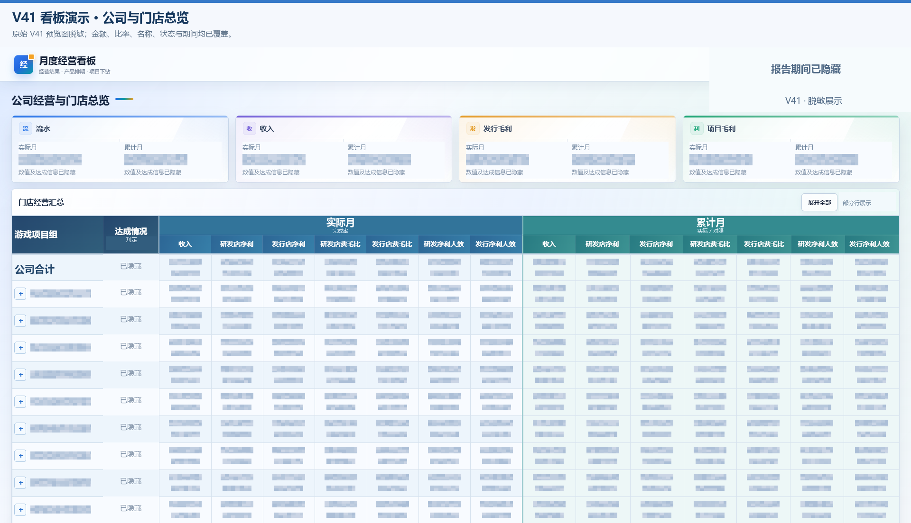
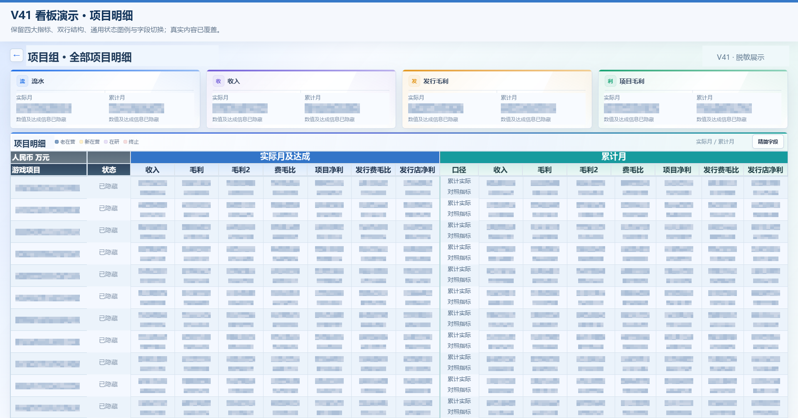
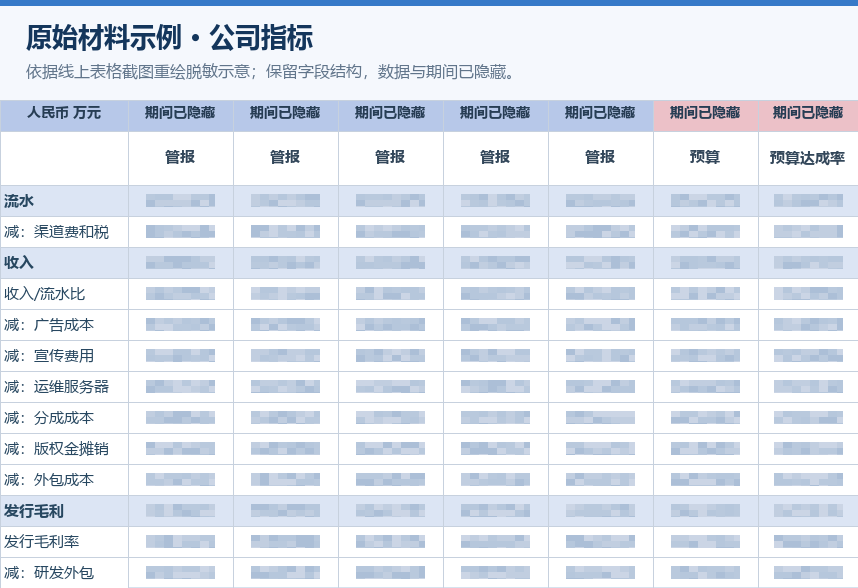
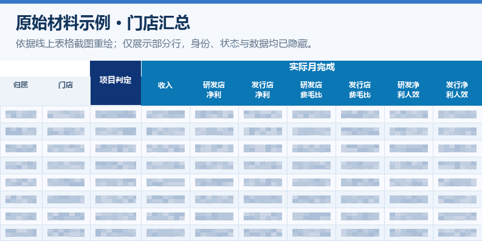
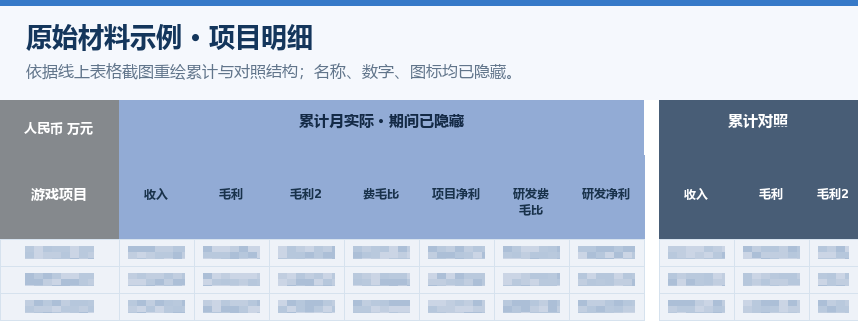

# 经营看板 Skills

**[▶ 打开 V41 在线交互演示](https://metal-water.github.io/operating-dashboard-skills/)** — 无需安装或登录，直接分享这个链接即可体验面板。

这个包为结构相近的月度经营材料提供稳定的生成和独立核对流程。使用者通过自然语言提出变化，不必手填字段配置。配置由代理在阅读当期文档后生成，连同来源证据保留在本次输出目录。

[使用与交接](TEAM_HANDOFF.md) · [复制 Prompt](PROMPTS.md) · [完整演示图与脱敏说明](docs/showcase/README.md)

## 看板演示 · 已脱敏

V41 视觉参考：公司指标卡、门店汇总、两层明细与实际/累计双行展示。金额、比率、名称、业务状态和报告期间已用不透明像素覆盖；下图为静态预览。

[](https://metal-water.github.io/operating-dashboard-skills/)

在线演示沿用 V41 的字体、商务渐变和两层表格交互，支持展开门店、项目下钻、字段切换、备注与排期查看。公开文件只使用匿名虚构行，经营数值已移除；马赛克后没有真实数据。演示页面位于 `docs/index.html`，由 GitHub Pages 发布，和 Skill 的实际生成流程分开维护。

<details>
<summary>展开查看 V41 第二层：项目明细</summary>



</details>

### 输入材料示例 · 已脱敏

以下三图依据已授权线上文档的关键表格截图制作。为清除文档水印中的身份信息，按原表字段与排布重绘脱敏示意；仅保留通用表头，不公开原始数据。点击图片可放大。

| 公司指标 | 门店汇总 | 项目明细 |
| --- | --- | --- |
| [](docs/showcase/source-company-redacted.png) | [](docs/showcase/source-stores-redacted.png) | [](docs/showcase/source-projects-redacted.png) |

源表示例与 V41 分别展示输入结构和视觉参考，并非同一期数据的对应验证。可运行的实例数据仍使用 [完全虚构的示例](examples/synthetic-report.json)；运行 `npm run demo` 可生成交互式 HTML。

## 使用

第一次交接给同事，请先看 [同事使用与交接指南](TEAM_HANDOFF.md)，再从 [PROMPTS.md](PROMPTS.md) 复制当期调用文本。

在支持 Agent Skills 的 Codex 中打开本仓库目录。两个 Skill 位于 `.agents/skills/`，这是当前官方文档中的仓库级发现路径。其他宿主按其安装约定导入对应 Skill 文件夹；不要假定所有应用的调用语法一致。

生成：

```text
使用 $operating-dashboard-workflow。
本期经营文档：<线上文档链接>。
沿用内置投屏模板，自动识别公司总表、门店总表、各店分表、月份和预算版本。
按源表默认可见行列展示（一级无全部字段，二级全部字段同时作用于行列），逐店配对主副值及图标，生成版本化看板和 handoff.json。
```

新对话复核：

```text
使用 $operating-dashboard-data-auditor。
读取生成目录中的 handoff.json，独立重读同版本来源，先列源字段清单，再核对公司、门店和项目的主副值、源隐藏行列、状态图标及数字颜色。
输出差异、来源、分维度覆盖率、当次重读/既有快照与无法确认项；核对阶段不要修改看板。
```

新对话由用户打开，或在用户明确要求时由宿主创建；Skill 文件本身不自动开启对话。复核 Skill 也可在当前对话调用，但应从原始来源重新取证。

完整调用文本见 [PROMPTS.md](PROMPTS.md)，包含“生成并独立核对”“只核对”“局部纠错”三种用途。0.2 已同步默认可见性、V41 视觉、双行分隔与状态分组、所有店的完整字段配对，以及完整单元格值防遮挡复核规则。

## 不用手改配置的分工

| 内容 | 默认由谁维护 |
| --- | --- |
| 字体、颜色、双行、冻结、两层交互 | 内置模板及 defaults.json |
| 本期月份、实际/累计、预算版本、表格、字段、行、来源位置 | 生成 Skill 自动识别 |
| “收入标题大一点”等当次调整 | 代理生成本次 display override，不改共享默认值 |
| 确认后的长期视觉规则变更 | 用户明确要求后升级模板版本 |
| 缺权限、同名项目无法区分、两个来源版本冲突 | 只询问具体缺口，保留未核对状态 |

源表中的对照列必须逐项识别。VS T2+10 可能是完成率，也可能是差额，不能仅凭标题推断。预算版本、会计口径和主体归属一起确定映射。

## 包含的可运行部分

- `operating-dashboard-workflow`：来源识别规则、视觉默认值、规范化数据校验、离线 HTML 渲染器、版本化输出、下一对话交接文件。
- `operating-dashboard-data-auditor`：独立取证规则和逐显示位置比较器，区分数据不一致、来源映射不一致、未覆盖。
- `examples/synthetic-report.json`：完全虚构数据，覆盖当月/累计、两种店分表、空值/0/负数、预算/达成率/费毛比差额。
- `tests`：数据契约和浏览器布局检查；默认可见毛利/毛利2、隐藏行列、单项目、状态排序、不同主副来源、长百分比与源字段漏映射均有虚构用例。

基础生成与数据测试需 Node.js 18+；团队建议使用 Node.js 22 或更新 LTS。当前浏览器测试依赖要求 Node.js 20+：

```sh
npm run demo
npm test
npm install
npx playwright install chromium
npm run test:ui
```

浏览器测试可用 `BROWSER_EXECUTABLE` 指定已有 Chrome/Edge 路径。代码没有写死 Windows 用户名、盘符或浏览器安装路径。

宿主限定浏览器操作必须通过 CUA 时，不执行独立 Playwright 驱动；用宿主浏览器在授权 localhost 预览上执行同样的交互与尺寸验收。`npm test` 是纯数据测试，不操控浏览器。

构建命令会创建新的 `outputs/<report-id>-vNNN/`，不会覆盖已有输出。`index.html` 可离线双击打开。`handoff.json` 和 `report.json` 保存源表定位与待核对事项。

## 当前能力边界

这是 0.2 版，基于已确认的看板修改提炼通用规则并以虚构材料验证。实际验证范围见 [VALIDATION.md](VALIDATION.md)，本包自测不是一次全量真实财务审计。读取线上文档由宿主已有的授权连接器、API 或浏览器能力完成；单独拿到链接不等于有访问权限。嵌入表格须记录完整表头、隐藏行列与实际读取范围。

旧规范化 report 需按新契约补充源可见性、空白证据、各店四卡及源字段清单；不要用默认值伪造源证据。数据 schemaVersion 仍为 1，交接文件以 templateVersion=0.2.0 标明模板版本。

配置自动化由 Skill 中的取证与映射流程实现，`build.cjs` 接收规范化报告，不会自己登录飞书。复杂合并表头、只有图片的数字或含义冲突应标为待核对，不能承诺任意链接一次零错误。

这是从最终确认规则提炼出的可复用模板，不是直接分发带真实数字的历史 HTML。与旧版逐像素一致不在本版本保证范围内。

## 分享到 GitHub

本仓库包含代码、模板、虚构示例、测试和经过脱敏的静态演示图。`outputs/`、`private/`、登录信息、未脱敏截图及真实源文档快照留在各使用者本地；`.gitignore` 已排除默认运行目录。网页手动上传不会替你应用本地忽略规则，上传前仍需确认文件范围。

团队可以克隆仓库后在仓库内调用两个 Skill。需要面向多个项目或其他支持的宿主统一安装时，再按官方插件规范包装；本包未冒充已安装插件。

官方依据：https://developers.openai.com/codex/skills/
